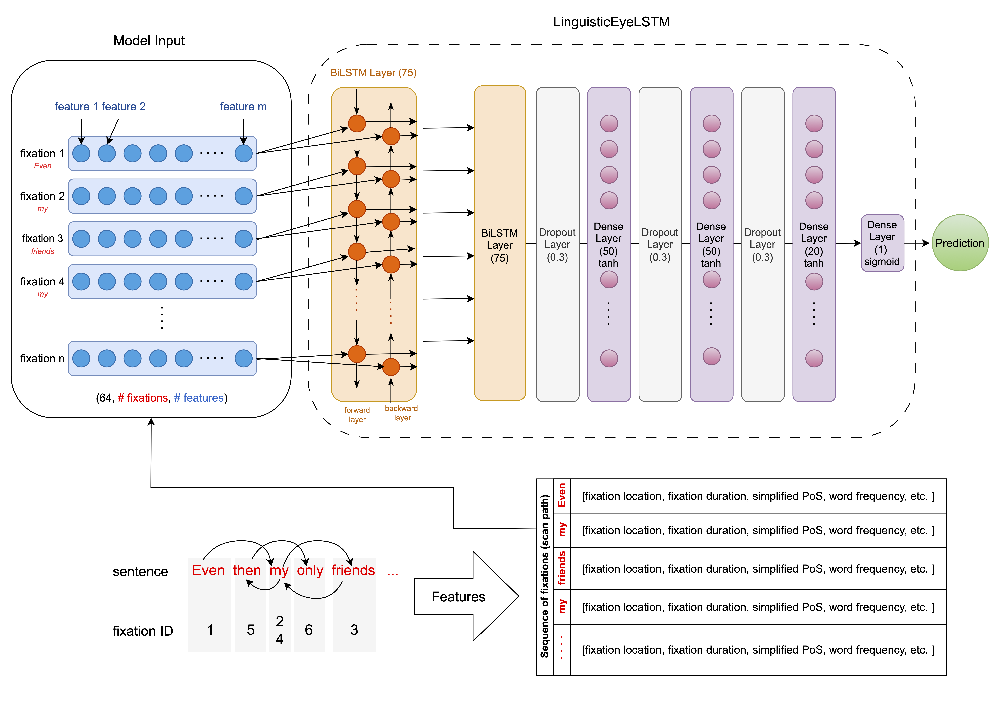
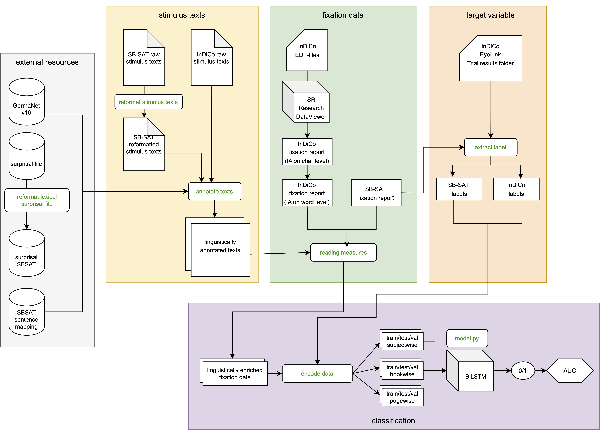

# Inferring text comprehension from eye movements in reading using deep neural sequence models
Masters Thesis by Laura Stahlhut, University of Zurich, Institute for Computational Linguistics (2023), Grade: 6

This repo contains the code belonging to my masters thesis "Inferring text comprehension from eye movements in reading using deep neural sequence models".

**LinguisticEyeLSTM** is a sequential neural architecture that processes the sequence of fixations during reading and infers 
the level of text comprehension.


## Repo Structure
```
project
│   README.md
│   requirements.txt
│      
└───data
│   └───SB-SAT
│   │   ...
│   │
│   └───InDiCo
│       └───external
│       │    
│       └───raw
│       │    └───stimuli
│       │         ...
│       │    └───fixation
│       │         ...
│       └───interim
│       │   ...
│       │   
│       └───processed
│           indico_fix_lexfeats_final.csv
│   
└───src
│   annotate_texts.py
│   encode_data.py
│   extract_label.py
│   map_fix_to_roi.py
│   preprocess_fixations.py
│   reading_measures.py
│   reformat_lexical_surprisal_SBSAT.py
│   reformat__SBSAT_texts.py
│   txt_to_csv.py
│   
└───nn
│   └───sbsat_splits
│   └───indico_splits
│   │   └───data_s1_rm1_lf1
│   │   └───data_s1_rm1_lf0
│   │   └───data_s1_rm0_lf0_pos_cont
│   │   └───data_s1_rm0_lf0
│   │   └───data_s0_rm1_lf0
│   │   └───data_s0_rm0_lf1
│   │        └───book
│   │        └───subject
│   │        └───book-page
│   │  
│   └───model.py
│   └───results
│       └───InDiCo
│       │    └───data_s1_rm1_lf1
│       │    └───...
│       └───SBSAT
│
└───notebooks
```
## Datasets

- **SB-SAT**: Stony Brook SAT reading fixation dataset (English stimuli). This dataset is publicly available data [here](https://github.com/ahnchive/SB-SAT). The expermients can be reproduced with the SB-SAT dataset.
```
https://github.com/aeye-lab/etra-reading-comprehension
```
- **InDiCo**: Individual Differences Corpus, compiled at the University of Zurich (German stimuli). This dataset is not publicly available. I had access to the edf files and exported the fixation report with the same columns that are in the SB-SAT dataset via SR Research's Dataviewer.


## How to reproduce the experiments with the SB-SAT dataset:

### Clone this repository
```
git clone git@github.com:l-stahlhut/inferring-reading-comprehension
```

The easiest way is to run `bash rerun_experiments.sh`. If you cannot execute the bash script it might be due to missing permission. You can grant it e.g. via `chmod +x rerun_experiments.sh`. You might need to repeat it for every bash script in [`scripts`](/scripts/). A command would be `chmod +x scripts/*.sh`. Two notes: First, you need to be either in an activate conda or virtual environment. Second, depending on your compute, this script might run for several days.

Otherwise you might want to manually rerun the scripts below to reproduce the results. Since the InDiCo dataset is not yet publicly available, the script will only run for the [SB-SAT dataset](https://github.com/ahnchive/SB-Sat).

### Install packages
```
pip install -r requirements.txt
```
Follow the instructions below to preprocess the data and perform classification. <br>
The following image gives an overview over the **general workflow** which includes data preprocessing (fixation data, stimulus texts and target variable), data encoding and classification.



# 1. Data preprocessing

## Stimulus texts 
### Preprocessing
1. Download the [stimulus texts](https://github.com/aeye-lab/etra-reading-comprehension/blob/main/utils/texts_sb_sat.txt)
and the [surprisal file](https://github.com/aeye-lab/etra-reading-comprehension/blob/main/utils/surprisal.csv).
Save both in `/data/SBSAT/interim/stimuli`.
2. Reformat the file for lexical surprisal and the SB-SAT texts. Reason: The text annotation code was initially written
 for InDiCo so we first have to bring the SBSAT texts into the same format. The reformated files are saved in
 `/data/SBSAT/raw/stimuli/lexical_surprisal` and `/data/SBSAT/raw/`stimuli/sbsat_sentences_screens.
````angular2html
python3 src/reformat_lexical_surprisal_SBSAT.py
python3 src/reformat_SBSAT_texts.py --reformat
````
### Linguistic annotation
Annotate the texts from this dataset:
````angular2html
python3 src/annotate_texts.py --SBSAT
````
The annotated texts are saved in /data/SB-SAT/interim/stimuli/annotated_texts.

## Fixation Data
### SB-SAT
1. Clone the [SB-SAT repository](https://github.com/ahnchive/SB-SAT). You can do it via `git clone git@github.com:ahnchive/SB-SAT`. Alternatively, you can also choose `git clone https://github.com/ahnchive/SB-SAT`. The latter option is discouraged by github. The last option is that you can download the zip file from the top right of the [repository](https://github.com/ahnchive/SB-SAT).
2. Move the fixation data file `SB-SAT/fixation/18sat_fixfinal.csv` to `data/SB-SAT/raw/`.

### InDiCo
- **(currently not publicly available)** I extracted the raw fixation data from InDiCo directly from SR Research Dataviewer.

### Preprocessing the raw fixation data: <br>

SB-SAT: Preprocessing involves dropping unnecessary rows and columns and deleting fixations outside of interest areas.

````angular2html
python3 src/preprocess_fixations.py --SBSAT
````
InDiCo: Preprocessing involves data cleaning, choosing relevant columns and mapping interest areas from the level
of characters to the level of words. 
````angular2html
python3 src/preprocess_fixations.py --InDiCo
````
### Calculating Reading measures and merging fixation reports with lexical features
The following script calculates reading measures and merges the fixation report and the lexical features after fixing
alignment problems. 

````angular2html
python3 src/reading_measures.py --InDiCo
python3 src/reading_measures.py --SBSAT
````
## Target variable
The label for the SB-SAT dataset gets extracted from the fixation report while the label for the InDiCo dataset gets 
extracted from the results folder of the experiment. 
````angular2html
python3 src/extract_label.py --SBSAT
python3 src/extract_label.py --InDiCo
````

# 2. Encoding the data
Encode the data by specifying the dataset and the desired features, for example: 
--s1_rm1_lf1
````angular2html
python3 src/encode_data.py --SBSAT --s1_rm1_lf1 
python3 src/encode_data.py --InDiCo --s1_rm1_lf0
````
Please refer to the code to see which flag refers to which version of the features.

# 3. Classification
Train the different model variations, e.g. for the SB-SAT dataset with all features:
````angular2html
python3 nn/model.py --GPU 0 --s1_rm1_lf1 --SBSAT --save_dir nn/results --weights_dir  nn/weights
````
This saves the results and model weights. The flags for the data variations of the dataset can be seen in the script. 
The evaluation of the model (Ahn _et al._ (2020) baseline implemented by Reich _et al._(2022)) is included in this script.

## Sources: 
- SB-SAT data: Ahn _et al._ (2020): https://github.com/ahnchive/SB-SAT
- Transforming interest areas: https://github.com/l-stahlhut/indiff-preprocessing/blob/main/parsing/map_fix_to_roi.py
- The preprocessing code is based on the InDiCo Preprocessing code (2022): https://github.com/l-stahlhut/individual-differences/tree/main/src (annotate_texts.py, reading_measures.py)
- The code for the data encoding and the model is based on Reich _et al._ (2022): https://github.com/aeye-lab/etra-reading-comprehension (model.py, 
 generate_text_sequence_splits.py) 
